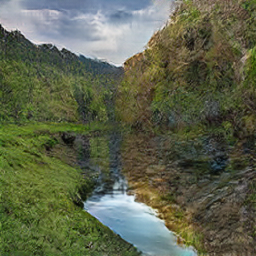

# Session-on-CycleGAN-2021-07-22

> On this session we talked about the amazing ideas of GAN, cycle consistency, singularity etc.

## Here is some of the fun transformations we got

Elsa through ```winter to summer filter```, and Elsa turned into satellite image

  

Monet painting reconstructing the scenary photo

 

Photo reconstructed from monet painting goes through ```summer to winter filter```


Wintered Photo reconstructed from monet painting stylzie as ukiyoe


